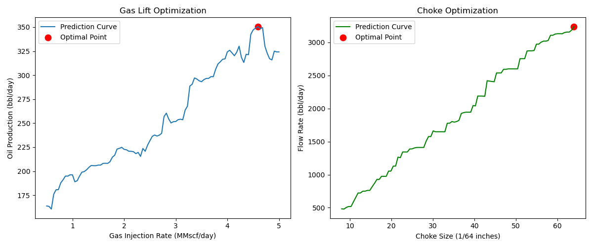

Perfect 👍 — here’s the **GitHub version** of your `README.md` with emojis kept for style and clarity. You can copy-paste it directly:

````markdown
# 🚀 Gas Lift & Choke Optimization using Machine Learning

## 📌 Overview

This project demonstrates how **Machine Learning (ML)** can be used to optimize **oil production in petroleum wells** by adjusting:

* **Gas Lift Injection Rate**
* **Choke Size**

Using **synthetic petroleum engineering data**, we train ML models to predict production performance and determine the **optimal operating conditions**.

---

## ⚡ Features

* 📊 **Synthetic data generation** (physics-inspired for realism)
* 🤖 **ML Models**:
  * Random Forest Regressor → Gas Lift optimization  
  * Gradient Boosting Regressor → Choke optimization  
* 🔍 **Optimization**: Finds the best gas injection rate and choke size for maximum production  
* 📈 **Visualization**: Plots optimization curves with the optimal point highlighted  
* 🛠️ **Fully reproducible**: No external data required  

---

## 🛠️ Tech Stack

* Python 3.9+  
* NumPy, Pandas  
* scikit-learn  
* Matplotlib  

---

## ▶️ How to Run

### 1️⃣ Clone the repository
```bash
git clone https://github.com/JanviMadhukar/gas_lift_optimization.git
cd gas_lift_optimization
````

### 2️⃣ Install dependencies

```bash
pip install -r requirements.txt
```

### 3️⃣ Run the project

```bash
python gas_lift_choke_optimization.py
```

---

## 📊 Example Output

**Model Performance**

```
Gas Lift Model R²: 0.81
Choke Model R²: 0.98

Optimal Gas Lift: 4.59 MMscf/day → 350 bbl/day
Optimal Choke: 64/64 inches → 3239 bbl/day
```

**Optimization Plots**


*(Left: Gas Lift Optimization, Right: Choke Optimization)*

---

## 📚 Engineering Significance

* **Gas Lift**: Too little gas = insufficient lift, too much gas = inefficiency
* **Choke**: Controls flow rate; the wrong setting reduces production
* **ML Advantage**: Finds the “sweet spot” quickly, without trial-and-error

---

## 📂 Project Structure

```
├── gas_lift_choke_optimization.py   # Main code
├── README.md                        # Documentation
└── example_output.png               # Sample plots (add after running)
```

---

## ✅ Future Improvements

* Add **economic optimization** (maximize profit, not just barrels/day)
* Extend to **multi-well optimization** with gas allocation
* Real-time data integration (SCADA / sensors)

---

## 👩‍💻 Author

Developed by **Janvi Madhukar**
For academic and research demonstration in **Petroleum Engineering + Machine Learning**
[LinkedIn](https://www.linkedin.com) | [Email](mailto:youremail@example.com)

---

🔥 With this project, you can clearly see how **data-driven optimization** improves petroleum production performance!

```

---

👉 Next, I can prepare the **plain version (college submission)** with **no emojis, no links, no extra styling**. Do you want me to generate that one too so you have both ready?
```
